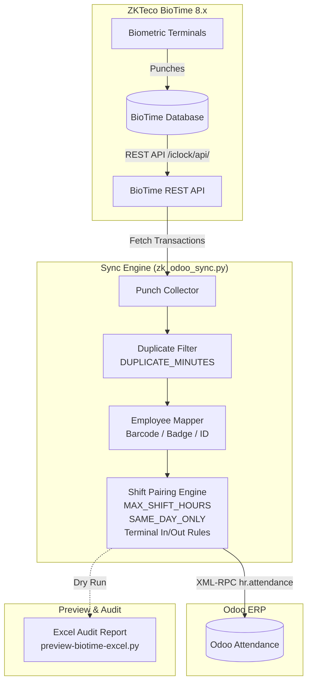

# ZKBioTime to Odoo Attendance Synchronization

[](https://www.python.org/)
[](https://www.odoo.com)
[](https://opensource.org/licenses/MIT)

A robust, idempotent synchronization bridge between **ZKTeco ZKBioTime** biometric time & attendance systems and **Odoo HR Attendance** (`hr.attendance`).

---

## Architecture & Data Flow



---

## Features

- **Idempotent by Design**: Uses Odoo's existing records as the source of truth. Re-running the synchronization will never duplicate attendances.
- **Smart Shift Pairing**: Reconstructs paired check-in and check-out records from raw punches. Automatically handles forgotten badge-outs or missed check-ins.
- **Duplicate & Bounce Suppression**: Filters out duplicate swipes occurring within a configurable window (e.g., less than 2 minutes apart).
- **Flexible In/Out Direction**: Supports fixed terminal assignment (dedicated entrance/exit turnstiles) or automatic chronological alternation.
- **Offline Device Catch-Up**: Configurable lookback period (e.g., 72 hours) allows capturing delayed punches from offline terminals once reconnected.
- **Process Lock**: File-based locking (`zk_odoo_sync.lock`) prevents overlapping cron jobs and historical transfers from colliding.
- **Excel Dry-Run Audit Tool**: Generates an exhaustive multi-sheet Excel workbook analyzing terminal health, anomalies, and expected shifts without touching Odoo.

---

## Project Structure

```
├── zk_odoo_sync.py            # Core engine: API clients, pairing logic & Odoo push
├── synchronization-script.py  # Incremental sync script (for cron / scheduled tasks)
├── data-trasnfer-odoo.py      # One-off initial historical transfer script
├── preview-biotime-excel.py   # Dry-run audit report generator (outputs .xlsx)
├── scrape_docs.py             # Utility to fetch & archive BioTime API documentation
├── zkbiotime_api_docs/        # Markdown reference for ZKBioTime API endpoints
├── requirements.txt           # Python dependencies
├── .env.example               # Environment variables template
└── .gitignore                 # Pre-configured git rules
```

---

## Prerequisites

- **Python**: 3.9 or higher
- **ZKBioTime**: 8.0, 8.5, or compatible REST API instance with an authorized user account
- **Odoo**: Community or Enterprise with the `hr_attendance` module installed and an active API Key

---

## Installation

1. **Clone the repository:**
   ```bash
   git clone https://github.com/your-username/zk-odoo-sync.git
   cd zk-odoo-sync
   ```

2. **Create and activate a virtual environment (optional but recommended):**
   ```bash
   python -m venv .venv
   # Windows:
   .venv\Scripts\activate
   # Linux/macOS:
   source .venv/bin/activate
   ```

3. **Install dependencies:**
   ```bash
   pip install -r requirements.txt
   ```

4. **Configure environment variables:**
   ```bash
   cp .env.example .env
   ```
   Edit `.env` with your instance credentials and preferences.

---

## Configuration Reference (`.env`)

| Variable | Default | Description |
| :--- | :--- | :--- |
| `BIOTIME_URL` | `http://localhost:8083` | Base URL of the ZKBioTime server |
| `BIOTIME_USER` | `admin` | ZKBioTime API username |
| `BIOTIME_PASS` | — | ZKBioTime API password |
| `BIOTIME_TZ` | `Europe/Paris` | Timezone of the BioTime server (e.g. `Africa/Casablanca`, `UTC`) |
| `ODOO_URL` | `https://votre-instance.odoo.com` | Base URL of the Odoo instance |
| `ODOO_DB` | `votre-base` | Name of the Odoo database |
| `ODOO_USER` | `admin@societe.com` | Email of the Odoo user |
| `ODOO_API_KEY` | — | Odoo user API Key (*User Preferences > Account Security > API Keys*) |
| `SAME_DAY_ONLY` | `1` | `1` = Check-in and check-out must occur on same calendar day; `0` = allow overnight shifts |
| `MAX_SHIFT_HOURS`| `16` | Maximum duration of an open shift before closing as a forgotten check-out |
| `DUPLICATE_MINUTES` | `2` | Ignore consecutive swipes within this number of minutes |
| `TERMINALS_IN` | — | Comma-separated serial numbers for dedicated entrance terminals |
| `TERMINALS_OUT` | — | Comma-separated serial numbers for dedicated exit terminals |

---

## How It Works

### Employee Mapping
The sync maps BioTime punches to Odoo employees using either:
1. **Badge ID / Barcode (`barcode`)** *(priority)*
2. **Identification / Matricule (`identification_id`)**

Ensure employees in Odoo have their `barcode` or `identification_id` set to match the BioTime `emp_code`.

### Timezone Conversion
- BioTime punch timestamps are recorded in local time (`BIOTIME_TZ`).
- The script automatically converts timestamps to naive UTC before creating records in Odoo's `hr.attendance` model.

---

## Usage

### 1. Dry Run / Inspection (Excel Export)
Before syncing to Odoo, generate a comprehensive audit report of your punches:
```bash
# Preview the last 30 days
python preview-biotime-excel.py

# Preview from a specific start date
python preview-biotime-excel.py 2025-01-01

# Preview a specific date range
python preview-biotime-excel.py 2025-01-01 2025-01-31
```
This generates an `.xlsx` file containing raw punches, detected shift pairings, employee summaries, and detected anomalies (e.g., forgotten badge-outs).

### 2. Initial Historical Import
To backfill historical attendance data into Odoo:
1. Set `START_DATE` in [`data-trasnfer-odoo.py`](file:///c:/Users/Sabrina/Desktop/idk/data-trasnfer-odoo.py).
2. Run:
   ```bash
   python data-trasnfer-odoo.py
   ```

### 3. Recurring Incremental Synchronization
Run periodically to synchronize recent punches:
```bash
python synchronization-script.py
```

#### Automating with Linux `crontab`:
```cron
# Run every 30 minutes
*/30 * * * * cd /path/to/zk-odoo-sync && /path/to/zk-odoo-sync/.venv/bin/python synchronization-script.py >> logs/cron.log 2>&1
```

#### Automating with Windows Task Scheduler:
- **Program/script**: `C:\path\to\python.exe`
- **Arguments**: `synchronization-script.py`
- **Start in**: `C:\path\to\zk-odoo-sync`

---

## Logging

All logs are written to the `logs/` directory:
- `logs/sync.log`: Routine cron execution logs.
- `logs/transfer.log`: Historical backfill logs.

---

## License

This project is open-source under the [MIT License](LICENSE).
